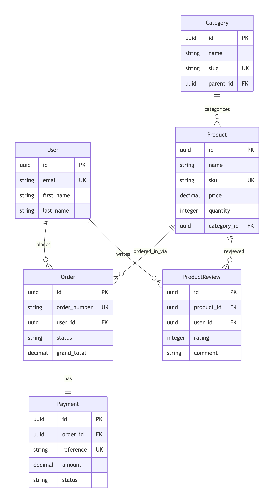

# ERD for E-Commerce Platform

The Entity-Relationship Diagram (ERD) below illustrates the key entities and their relationships in the E-Commerce Platform.

## Simplified ER Diagram (Core Entities Only)



## Entity Descriptions with Cardinality

### Core Business Entities:

**User** (1) ── (1) **UserProfile** (One-to-One)

Each user has exactly one profile

Profile contains extended user information

**User** (1) ── (N) **Address** (One-to-Many)

A user can have multiple addresses

Addresses can be marked as default shipping/billing

**Category** (1) ── (N) **Category** (Self-referential)

Categories can have parent categories for hierarchies

Enables nested category structures

**Category** (1) ── (N) **Product** (One-to-Many)

Each product belongs to one category

A category can have multiple products

**Product** (1) ── (N) **ProductVariant** (One-to-Many)

A product can have multiple variants (colors, sizes)

Each variant has its own SKU, price, and inventory

**Product** (1) ── (N) **ProductImage** (One-to-Many)

Multiple images per product

One image can be marked as primary

### Order Management Relationships:

**User** (1) ── (N) **Order** (One-to-Many)

A user can place multiple orders

Orders reference the user who placed them

**Order** (1) ── (N) **OrderItem** (One-to-Many)

Each order contains multiple items

Order items capture the state of products at time of purchase

**Order** (1) ── (1) **Payment** (One-to-One)

Each order has exactly one payment record

Payment tracks transaction details

**Order** (1) ── (1) **OrderShipment** (One-to-One)

Each order has one shipment record

Tracks shipping method and delivery status

### Review System Relationships:

**Product** (1) ── (N) **ProductReview** (One-to-Many)

A product can have multiple reviews

Reviews are linked to specific products

**User** (1) ── (N) **ProductReview** (One-to-Many)

A user can write multiple reviews

Ensures one review per product per user

**OrderItem** (1) ── (1) **ProductReview** (One-to-One)

Each review can be linked to a specific purchase

Enables verified purchase badges

### Inventory Management:
**Product** (1) ── (N) **Inventory** (One-to-Many)

A product can be stocked in multiple warehouses

Tracks quantity per location

**Warehouse** (1) ── (N) **Inventory** (One-to-Many)

Each warehouse can store multiple products

Manages stock across locations

## Key Business Rules & Constraints

### 1. Order Lifecycle Constraints:

```-- Order status progression
CREATE TYPE order_status AS ENUM (
    'pending',
    'processing', 
    'shipped',
    'delivered',
    'cancelled',
    'refunded'
);

-- Payment status dependency
ALTER TABLE orders 
ADD CONSTRAINT check_payment_status 
CHECK (
    (status = 'pending' AND payment_status IN ('pending', 'failed')) OR
    (status IN ('processing', 'shipped', 'delivered') AND payment_status = 'paid') OR
    (status IN ('cancelled', 'refunded') AND payment_status IN ('refunded', 'cancelled'))
);
```

### 2. Inventory Constraints:

```-- Prevent negative inventory
ALTER TABLE inventory 
ADD CONSTRAINT non_negative_quantity 
CHECK (quantity >= 0);

-- Stock movement triggers
CREATE TRIGGER update_inventory_on_order
AFTER INSERT ON order_items
FOR EACH ROW
EXECUTE FUNCTION decrement_inventory();
```

###3. Review Validation:

```-- One review per product per user
ALTER TABLE product_reviews
ADD CONSTRAINT unique_product_user_review 
UNIQUE (product_id, user_id);

-- Verified purchase requirement
ALTER TABLE product_reviews
ADD CONSTRAINT verified_purchase_check 
CHECK (
    is_verified_purchase = false OR 
    (is_verified_purchase = true AND order_item_id IS NOT NULL)
);
```

## Indexing Strategy

### Primary Indexes:

```-- User lookups
CREATE INDEX idx_users_email ON users(email);
CREATE INDEX idx_users_created ON users(created_at);

-- Product search optimization
CREATE INDEX idx_products_slug ON products(slug);
CREATE INDEX idx_products_sku ON products(sku);
CREATE INDEX idx_products_category_published ON products(category_id, is_published);
CREATE INDEX idx_products_price_range ON products(price) WHERE is_published = true;

-- Order queries
CREATE INDEX idx_orders_user ON orders(user_id);
CREATE INDEX idx_orders_status ON orders(status);
CREATE INDEX idx_orders_placed ON orders(placed_at);

-- Inventory management
CREATE INDEX idx_inventory_low_stock ON inventory(quantity) WHERE quantity < low_stock_threshold;
```

### Composite Indexes:

```-- For product filtering
CREATE INDEX idx_products_filtering ON products(
    category_id, 
    price, 
    is_published, 
    created_at DESC
);

-- For order analytics
CREATE INDEX idx_orders_analytics ON orders(
    placed_at, 
    status, 
    grand_total
);

-- For review queries
CREATE INDEX idx_reviews_product_rating ON product_reviews(
    product_id, 
    rating DESC, 
    is_approved
);
```

## Data Migration & Versioning

### Version Control Strategy:

```-- Audit trail for critical tables
CREATE TABLE products_audit (
    audit_id UUID PRIMARY KEY,
    product_id UUID NOT NULL,
    operation VARCHAR(10) NOT NULL,
    old_values JSONB,
    new_values JSONB,
    changed_by UUID REFERENCES users(id),
    changed_at TIMESTAMP DEFAULT CURRENT_TIMESTAMP
);

-- Soft delete implementation
ALTER TABLE products ADD COLUMN deleted_at TIMESTAMP;
CREATE INDEX idx_products_deleted ON products(deleted_at) WHERE deleted_at IS NULL;
```

## Performance Considerations

### 1. Read Optimization:

Frequently accessed data: Cache product details, categories, user sessions

Search optimization: Materialized views for product search facets

Denormalization: Store calculated fields (average ratings, total sales)

### 2. Write Optimization:

Batch operations: Bulk inserts for inventory updates

Queue processing: Async processing for order fulfillment, email notifications

Transaction isolation: Appropriate isolation levels for concurrent updates

### 3. Scalability Patterns:

Sharding strategy: Shard by user_id for user-related data

Read replicas: Separate read replicas for analytics queries

Partitioning: Time-based partitioning for orders and audit logs

This ER diagram provides a comprehensive blueprint for the database schema, ensuring:

Data integrity through proper relationships and constraints

Performance through strategic indexing and normalization

Scalability through thoughtful design patterns

Maintainability through clear entity relationships and documentation
