# Database Normalization Analysis & 3NF Implementation

## **Current Schema Analysis for Normalization Violations**

### **Identified Issues:**

1. **Violation 1: Repetitive Address Data in Multiple Tables**
2. **Violation 2: Composite Values in JSONB Columns**
3. **Violation 3: Calculated Fields Stored Redundantly**
4. **Violation 4: Inconsistent Category Hierarchy Implementation**
5. **Violation 5: Product Attributes Denormalized**

## **Normalized Schema Design (3NF Compliant)**

```mermaid
erDiagram
    %% =============================================
    %% USER DOMAIN (Normalized)
    %% =============================================
    User {
        uuid id PK
        string email UK
        string password_hash
        string first_name
        string last_name
        boolean is_active
        boolean is_staff
        boolean is_superuser
        timestamp created_at
        timestamp updated_at
    }

    Address {
        uuid id PK
        uuid user_id FK
        string address_type "home/work/billing/shipping"
        string contact_name
        string phone
        string street_line1
        string street_line2
        string city
        string state_province
        string postal_code
        string country_code FK
        boolean is_default
        timestamp created_at
        timestamp updated_at
    }

    Country {
        string code PK "ISO 3166-1 alpha-2"
        string name
        string phone_code
        string currency_code
        boolean is_active
    }

    %% =============================================
    %% PRODUCT CATALOG (Normalized)
    %% =============================================
    Category {
        uuid id PK
        string name
        string slug UK
        text description
        uuid parent_id FK
        integer depth_level
        string path "Materialized path"
        integer sort_order
        boolean is_active
        timestamp created_at
        timestamp updated_at
    }

    Product {
        uuid id PK
        string name
        string slug UK
        text short_description
        text long_description
        string sku UK
        uuid category_id FK
        uuid brand_id FK
        decimal base_price
        boolean is_published
        boolean is_featured
        boolean is_digital
        decimal weight_grams
        timestamp created_at
        timestamp updated_at
        timestamp published_at
    }

    Brand {
        uuid id PK
        string name
        string slug UK
        text description
        string logo_url
        boolean is_active
        timestamp created_at
        timestamp updated_at
    }

    ProductPrice {
        uuid id PK
        uuid product_id FK
        decimal sale_price
        decimal compare_at_price
        decimal cost_price
        date effective_from
        date effective_to
        timestamp created_at
    }

    ProductInventory {
        uuid id PK
        uuid product_id FK
        uuid warehouse_id FK
        integer available_quantity
        integer reserved_quantity
        integer low_stock_threshold
        timestamp last_counted
        timestamp created_at
        timestamp updated_at
    }

    ProductDimension {
        uuid id PK
        uuid product_id FK
        decimal length_cm
        decimal width_cm
        decimal height_cm
        string dimension_unit
        timestamp created_at
    }

    %% =============================================
    %% ATTRIBUTE MANAGEMENT (Fully Normalized)
    %% =============================================
    AttributeDefinition {
        uuid id PK
        string name
        string slug UK
        string display_name
        string data_type "text/number/boolean/select/color"
        string input_type "text/select/radio/checkbox/color_picker"
        boolean is_filterable
        boolean is_required
        boolean is_variant_attribute
        integer sort_order
        timestamp created_at
        timestamp updated_at
    }

    AttributeValue {
        uuid id PK
        uuid attribute_id FK
        string value_text
        decimal value_number
        boolean value_boolean
        string display_value
        string color_hex
        integer sort_order
        timestamp created_at
    }

    ProductAttribute {
        uuid id PK
        uuid product_id FK
        uuid attribute_id FK
        uuid attribute_value_id FK
        timestamp created_at
    }

    %% =============================================
    %% PRODUCT VARIANTS (Normalized)
    %% =============================================
    ProductVariant {
        uuid id PK
        uuid product_id FK
        string sku UK
        string name
        decimal price_adjustment "+/- from base price"
        integer available_quantity
        boolean is_default
        timestamp created_at
        timestamp updated_at
    }

    VariantAttribute {
        uuid id PK
        uuid variant_id FK
        uuid attribute_id FK
        uuid attribute_value_id FK
        timestamp created_at
    }

    %% =============================================
    %% MEDIA MANAGEMENT (Normalized)
    %% =============================================
    Media {
        uuid id PK
        string media_type "image/video/document"
        string original_filename
        string storage_path
        string mime_type
        integer file_size_bytes
        string alt_text
        jsonb metadata
        timestamp uploaded_at
        timestamp created_at
    }

    ProductMedia {
        uuid id PK
        uuid product_id FK
        uuid media_id FK
        string media_role "main/gallery/thumbnail/document"
        integer sort_order
        timestamp created_at
    }

    %% =============================================
    %% ORDER MANAGEMENT (Normalized)
    %% =============================================
    Order {
        uuid id PK
        string order_number UK
        uuid user_id FK
        uuid shipping_address_id FK
        uuid billing_address_id FK
        string order_status FK
        decimal items_subtotal
        decimal shipping_total
        decimal tax_total
        decimal discount_total
        decimal grand_total
        string currency_code
        timestamp placed_at
        timestamp created_at
        timestamp updated_at
    }

    OrderStatus {
        string code PK "pending/processing/shipped/delivered/cancelled/refunded"
        string name
        string description
        integer sort_order
        boolean is_terminal
    }

    OrderItem {
        uuid id PK
        uuid order_id FK
        uuid product_id FK
        uuid variant_id FK
        string product_name
        string sku
        integer quantity
        decimal unit_price
        decimal total_price
        timestamp created_at
    }

    OrderItemPriceSnapshot {
        uuid id PK
        uuid order_item_id FK
        decimal base_price
        decimal sale_price
        decimal applied_discount
        decimal tax_rate
        timestamp created_at
    }

    %% =============================================
    %% PAYMENT & SHIPPING (Normalized)
    %% =============================================
    PaymentMethod {
        string code PK "card/bank_transfer/mobile_money/cash"
        string name
        boolean is_active
        timestamp created_at
    }

    Payment {
        uuid id PK
        uuid order_id FK
        string gateway "paystack/stripe"
        string gateway_transaction_id
        string reference UK
        decimal amount
        string currency_code
        string payment_method_code FK
        string payment_status FK
        jsonb gateway_response
        timestamp paid_at
        timestamp created_at
        timestamp updated_at
    }

    PaymentStatus {
        string code PK "pending/processing/completed/failed/refunded"
        string name
        string description
    }

    ShippingMethod {
        uuid id PK
        string name
        string code UK
        string carrier
        decimal base_cost
        decimal cost_per_kg
        decimal free_shipping_threshold
        integer estimated_days_min
        integer estimated_days_max
        boolean is_active
        timestamp created_at
        timestamp updated_at
    }

    OrderShipment {
        uuid id PK
        uuid order_id FK
        uuid shipping_method_id FK
        string tracking_number
        timestamp shipped_at
        timestamp estimated_delivery
        timestamp delivered_at
        timestamp created_at
        timestamp updated_at
    }

    %% =============================================
    %% PRICING & DISCOUNTS (Normalized)
    %% =============================================
    TaxRate {
        uuid id PK
        string country_code FK
        string state_province
        decimal rate "Percentage"
        string tax_type "vat/gst/sales_tax"
        timestamp effective_from
        timestamp effective_to
        timestamp created_at
    }

    Currency {
        string code PK "ISO 4217"
        string name
        string symbol
        decimal exchange_rate_to_usd
        timestamp rate_updated_at
    }

    Coupon {
        uuid id PK
        string code UK
        string discount_type "percentage/fixed_amount/free_shipping"
        decimal discount_value
        decimal minimum_order_amount
        integer usage_limit
        integer usage_limit_per_user
        date valid_from
        date valid_to
        boolean is_active
        timestamp created_at
        timestamp updated_at
    }

    CouponUsage {
        uuid id PK
        uuid coupon_id FK
        uuid order_id FK
        uuid user_id FK
        decimal discount_amount
        timestamp used_at
    }

    %% =============================================
    %% REVIEWS & RATINGS (Normalized)
    %% =============================================
    ProductReview {
        uuid id PK
        uuid product_id FK
        uuid user_id FK
        uuid order_item_id FK
        integer rating "1-5"
        string title
        text comment
        string moderation_status "pending/approved/rejected"
        integer helpful_votes
        integer unhelpful_votes
        boolean is_verified_purchase
        timestamp created_at
        timestamp updated_at
    }

    ReviewMedia {
        uuid id PK
        uuid review_id FK
        uuid media_id FK
        integer sort_order
        timestamp created_at
    }

    ReviewVote {
        uuid id PK
        uuid review_id FK
        uuid user_id FK
        boolean is_helpful
        timestamp created_at
    }

    %% =============================================
    %% WAREHOUSE & INVENTORY (Normalized)
    %% =============================================
    Warehouse {
        uuid id PK
        string name
        string code UK
        uuid address_id FK
        boolean is_active
        timestamp created_at
        timestamp updated_at
    }

    StockMovement {
        uuid id PK
        uuid inventory_id FK
        string movement_type "incoming/outgoing/adjustment/transfer"
        integer quantity_change
        integer quantity_before
        integer quantity_after
        string reference_type "order/return/adjustment"
        uuid reference_id
        string notes
        timestamp created_at
    }

    %% =============================================
    %% RELATIONSHIPS
    %% =============================================

    %% Normalized User Relationships
    User ||--o{ Address : "has"
    Address }|--|| Country : "references"

    %% Normalized Product Relationships
    Product }|--|| Category : "belongs_to"
    Product }|--o| Brand : "has_brand"
    Product ||--o{ ProductPrice : "has_pricing"
    Product ||--o{ ProductInventory : "has_inventory"
    Product ||--o{ ProductDimension : "has_dimensions"
    Product ||--o{ ProductAttribute : "has_attributes"
    Product ||--o{ ProductVariant : "has_variants"
    Product ||--o{ ProductMedia : "has_media"

    ProductAttribute }|--|| AttributeDefinition : "references"
    ProductAttribute }|--|| AttributeValue : "has_value"

    ProductVariant ||--o{ VariantAttribute : "has_attributes"

    ProductMedia }|--|| Media : "references"

    %% Normalized Order Relationships
    Order }|--|| User : "placed_by"
    Order }|--|| Address : "shipped_to"
    Order }|--|| Address : "billed_to"
    Order }|--|| OrderStatus : "has_status"
    Order ||--o{ OrderItem : "contains"
    Order ||--|| Payment : "has_payment"
    Order ||--o| OrderShipment : "has_shipment"

    OrderItem }|--|| Product : "references_product"
    OrderItem }|--o| ProductVariant : "references_variant"
    OrderItem ||--|| OrderItemPriceSnapshot : "price_snapshot"

    Payment }|--|| PaymentMethod : "uses_method"
    Payment }|--|| PaymentStatus : "has_status"

    OrderShipment }|--|| ShippingMethod : "uses_method"

    %% Normalized Review Relationships
    ProductReview }|--|| Product : "reviews"
    ProductReview }|--|| User : "written_by"
    ProductReview }|--|| OrderItem : "verified_by"
    ProductReview ||--o{ ReviewMedia : "has_media"
    ProductReview ||--o{ ReviewVote : "receives_votes"

    ReviewMedia }|--|| Media : "references"

    %% Warehouse Relationships
    Warehouse }|--|| Address : "located_at"

```



## **Normalization Improvements & Explanations**

### **1. Address Normalization (From 1NF to 3NF)**

**Before (Denormalized):**

```sql
-- Address fields repeated in multiple tables
CREATE TABLE orders (
    shipping_street VARCHAR(255),
    shipping_city VARCHAR(100),
    shipping_state VARCHAR(100),
    billing_street VARCHAR(255),
    -- ... repeated in users, warehouses, etc.
);

```

**After (Normalized):**

```sql
-- Single address table with foreign keys
CREATE TABLE addresses (
    id UUID PRIMARY KEY,
    user_id UUID REFERENCES users(id),
    address_type VARCHAR(20), -- home/work/billing/shipping
    street_line1 VARCHAR(255),
    street_line2 VARCHAR(255),
    city VARCHAR(100),
    state_province VARCHAR(100),
    postal_code VARCHAR(20),
    country_code CHAR(2) REFERENCES countries(code)
);

-- Reference addresses by ID
CREATE TABLE orders (
    shipping_address_id UUID REFERENCES addresses(id),
    billing_address_id UUID REFERENCES addresses(id)
);

```

**Normalization Benefits:**

- Eliminates data duplication across tables
- Single source of truth for address validation
- Easier maintenance of address formatting rules
- Supports international address formats consistently

---

### **2. Price Management Normalization**

**Before (Redundant Storage):**

```sql
CREATE TABLE products (
    price DECIMAL(10,2),
    compare_price DECIMAL(10,2),
    cost_price DECIMAL(10,2)
    -- Prices duplicated in variants
);

```

**After (Time-based Price Tracking):**

```sql
CREATE TABLE product_prices (
    id UUID PRIMARY KEY,
    product_id UUID REFERENCES products(id),
    sale_price DECIMAL(10,2),
    compare_at_price DECIMAL(10,2),
    cost_price DECIMAL(10,2),
    effective_from DATE NOT NULL,
    effective_to DATE,
    created_at TIMESTAMP
);

-- Variants reference base price with adjustments
CREATE TABLE product_variants (
    price_adjustment DECIMAL(10,2) -- +/- from base price
);

```

**Normalization Benefits:**

- Historical price tracking for analytics
- Support for scheduled price changes
- Clear separation of base price vs. variant adjustments
- Eliminates price duplication between products and variants

---

### **3. Attribute System Normalization (To 3NF)**

**Before (JSONB Denormalization):**

```sql
CREATE TABLE products (
    attributes JSONB -- Mixed data types, hard to query/filter
);

```

**After (EAV Pattern Normalized):**

```sql
-- 1. Attribute Definitions (3NF)
CREATE TABLE attribute_definitions (
    id UUID PRIMARY KEY,
    name VARCHAR(100),
    slug VARCHAR(100) UNIQUE,
    data_type VARCHAR(20), -- text/number/boolean/select
    input_type VARCHAR(20), -- text/select/radio/color_picker
    is_filterable BOOLEAN DEFAULT false,
    is_required BOOLEAN DEFAULT false
);

-- 2. Predefined Values for Select Attributes (3NF)
CREATE TABLE attribute_values (
    id UUID PRIMARY KEY,
    attribute_id UUID REFERENCES attribute_definitions(id),
    value_text VARCHAR(255),
    value_number DECIMAL(10,2),
    value_boolean BOOLEAN,
    display_value VARCHAR(255),
    color_hex CHAR(7),
    sort_order INTEGER
);

-- 3. Product-Attribute Relationships (3NF)
CREATE TABLE product_attributes (
    id UUID PRIMARY KEY,
    product_id UUID REFERENCES products(id),
    attribute_id UUID REFERENCES attribute_definitions(id),
    attribute_value_id UUID REFERENCES attribute_values(id)
);

```

**Normalization Benefits:**

- Strong typing of attribute values
- Efficient filtering and searching
- Maintainable attribute definitions
- Support for faceted search
- Validation of attribute values

---

### **4. Media Management Normalization**

**Before (URLs scattered):**

```sql
CREATE TABLE product_images (
    image_url VARCHAR(500) -- Duplicated across reviews, products, etc.
);

```

**After (Centralized Media Registry):**

```sql
CREATE TABLE media (
    id UUID PRIMARY KEY,
    media_type VARCHAR(20), -- image/video/document
    original_filename VARCHAR(255),
    storage_path VARCHAR(500),
    mime_type VARCHAR(100),
    file_size_bytes INTEGER,
    alt_text VARCHAR(255),
    metadata JSONB
);

CREATE TABLE product_media (
    product_id UUID REFERENCES products(id),
    media_id UUID REFERENCES media(id),
    media_role VARCHAR(20) -- main/gallery/thumbnail
);

```

**Normalization Benefits:**

- Single media storage management
- Reduced storage duplication
- Consistent metadata handling
- Easy media lifecycle management

---

### **5. Calculated Fields Removal (3NF Compliance)**

**Before (Redundant Calculations):**

```sql
CREATE TABLE carts (
    subtotal DECIMAL(10,2), -- Calculated, should not be stored
    total DECIMAL(10,2)     -- Calculated, violates 3NF
);

CREATE TABLE products (
    average_rating DECIMAL(3,2) -- Derived from reviews
);

```

**After (3NF Compliant):**

```sql
-- Remove calculated fields, compute on demand or cache separately
CREATE TABLE carts (
    -- No calculated totals stored
);

-- Use views or materialized views for aggregates
CREATE VIEW product_ratings AS
SELECT
    product_id,
    AVG(rating) as average_rating,
    COUNT(*) as review_count
FROM product_reviews
WHERE moderation_status = 'approved'
GROUP BY product_id;

```

**Normalization Benefits:**

- Eliminates update anomalies
- Ensures data consistency
- Single source of truth for calculations

---

## **SQL Implementation of Normalized Schema**

```sql
-- ============================================
-- COUNTRY REFERENCE TABLE (3NF)
-- ============================================
CREATE TABLE countries (
    code CHAR(2) PRIMARY KEY, -- ISO 3166-1 alpha-2
    name VARCHAR(100) NOT NULL,
    phone_code VARCHAR(10),
    currency_code CHAR(3),
    is_active BOOLEAN DEFAULT true,
    created_at TIMESTAMP DEFAULT CURRENT_TIMESTAMP
);

-- ============================================
-- NORMALIZED ADDRESS TABLE (3NF)
-- ============================================
CREATE TABLE addresses (
    id UUID PRIMARY KEY DEFAULT gen_random_uuid(),
    user_id UUID REFERENCES users(id) ON DELETE CASCADE,
    address_type VARCHAR(20) NOT NULL CHECK (
        address_type IN ('home', 'work', 'billing', 'shipping')
    ),
    contact_name VARCHAR(255),
    phone VARCHAR(50),
    street_line1 VARCHAR(255) NOT NULL,
    street_line2 VARCHAR(255),
    city VARCHAR(100) NOT NULL,
    state_province VARCHAR(100),
    postal_code VARCHAR(20) NOT NULL,
    country_code CHAR(2) REFERENCES countries(code),
    is_default BOOLEAN DEFAULT false,
    created_at TIMESTAMP DEFAULT CURRENT_TIMESTAMP,
    updated_at TIMESTAMP DEFAULT CURRENT_TIMESTAMP,

    CONSTRAINT fk_country_code FOREIGN KEY (country_code)
        REFERENCES countries(code)
);

-- Indexes for address queries
CREATE INDEX idx_addresses_user ON addresses(user_id);
CREATE INDEX idx_addresses_user_type ON addresses(user_id, address_type);
CREATE INDEX idx_addresses_country ON addresses(country_code);

-- ============================================
-- ATTRIBUTE SYSTEM (EAV - 3NF)
-- ============================================
CREATE TABLE attribute_definitions (
    id UUID PRIMARY KEY DEFAULT gen_random_uuid(),
    name VARCHAR(100) NOT NULL,
    slug VARCHAR(100) UNIQUE NOT NULL,
    display_name VARCHAR(100),
    data_type VARCHAR(20) NOT NULL CHECK (
        data_type IN ('text', 'number', 'boolean', 'select', 'color')
    ),
    input_type VARCHAR(20) NOT NULL CHECK (
        input_type IN ('text', 'select', 'radio', 'checkbox', 'color_picker')
    ),
    is_filterable BOOLEAN DEFAULT false,
    is_required BOOLEAN DEFAULT false,
    is_variant_attribute BOOLEAN DEFAULT false,
    sort_order INTEGER DEFAULT 0,
    created_at TIMESTAMP DEFAULT CURRENT_TIMESTAMP,
    updated_at TIMESTAMP DEFAULT CURRENT_TIMESTAMP
);

CREATE TABLE attribute_values (
    id UUID PRIMARY KEY DEFAULT gen_random_uuid(),
    attribute_id UUID NOT NULL REFERENCES attribute_definitions(id)
        ON DELETE CASCADE,
    value_text VARCHAR(255),
    value_number DECIMAL(10,2),
    value_boolean BOOLEAN,
    display_value VARCHAR(255),
    color_hex CHAR(7), -- #RRGGBB format
    sort_order INTEGER DEFAULT 0,
    created_at TIMESTAMP DEFAULT CURRENT_TIMESTAMP,

    -- Ensure only one value type is set based on attribute data_type
    CONSTRAINT chk_value_type CHECK (
        (value_text IS NOT NULL AND value_number IS NULL AND value_boolean IS NULL) OR
        (value_text IS NULL AND value_number IS NOT NULL AND value_boolean IS NULL) OR
        (value_text IS NULL AND value_number IS NULL AND value_boolean IS NOT NULL)
    )
);

CREATE TABLE product_attributes (
    id UUID PRIMARY KEY DEFAULT gen_random_uuid(),
    product_id UUID NOT NULL REFERENCES products(id) ON DELETE CASCADE,
    attribute_id UUID NOT NULL REFERENCES attribute_definitions(id),
    attribute_value_id UUID NOT NULL REFERENCES attribute_values(id),
    created_at TIMESTAMP DEFAULT CURRENT_TIMESTAMP,

    UNIQUE(product_id, attribute_id),

    CONSTRAINT fk_attribute_value_type CHECK (
        EXISTS (
            SELECT 1 FROM attribute_values av
            JOIN attribute_definitions ad ON av.attribute_id = ad.id
            WHERE av.id = attribute_value_id
            AND ad.id = attribute_id
        )
    )
);

-- ============================================
-- PRICE HISTORY (3NF - Time-based)
-- ============================================
CREATE TABLE product_prices (
    id UUID PRIMARY KEY DEFAULT gen_random_uuid(),
    product_id UUID NOT NULL REFERENCES products(id) ON DELETE CASCADE,
    sale_price DECIMAL(10,2) NOT NULL CHECK (sale_price >= 0),
    compare_at_price DECIMAL(10,2) CHECK (compare_at_price >= 0),
    cost_price DECIMAL(10,2) CHECK (cost_price >= 0),
    effective_from DATE NOT NULL,
    effective_to DATE,
    created_at TIMESTAMP DEFAULT CURRENT_TIMESTAMP,

    CHECK (effective_to IS NULL OR effective_to > effective_from),

    -- Ensure no overlapping price periods for same product
    EXCLUDE USING gist (
        product_id WITH =,
        daterange(effective_from, effective_to, '[]') WITH &&
    )
);

-- Function to get current price
CREATE OR REPLACE FUNCTION get_current_product_price(product_uuid UUID)
RETURNS DECIMAL AS $$
DECLARE
    current_price DECIMAL;
BEGIN
    SELECT sale_price INTO current_price
    FROM product_prices
    WHERE product_id = product_uuid
    AND effective_from <= CURRENT_DATE
    AND (effective_to IS NULL OR effective_to >= CURRENT_DATE)
    ORDER BY effective_from DESC
    LIMIT 1;

    RETURN COALESCE(current_price, 0);
END;
$$ LANGUAGE plpgsql;

-- ============================================
-- INVENTORY MANAGEMENT (3NF)
-- ============================================
CREATE TABLE warehouses (
    id UUID PRIMARY KEY DEFAULT gen_random_uuid(),
    name VARCHAR(255) NOT NULL,
    code VARCHAR(50) UNIQUE NOT NULL,
    address_id UUID REFERENCES addresses(id),
    is_active BOOLEAN DEFAULT true,
    created_at TIMESTAMP DEFAULT CURRENT_TIMESTAMP,
    updated_at TIMESTAMP DEFAULT CURRENT_TIMESTAMP
);

CREATE TABLE product_inventory (
    id UUID PRIMARY KEY DEFAULT gen_random_uuid(),
    product_id UUID NOT NULL REFERENCES products(id) ON DELETE CASCADE,
    warehouse_id UUID NOT NULL REFERENCES warehouses(id) ON DELETE CASCADE,
    available_quantity INTEGER NOT NULL DEFAULT 0 CHECK (available_quantity >= 0),
    reserved_quantity INTEGER NOT NULL DEFAULT 0 CHECK (reserved_quantity >= 0),
    low_stock_threshold INTEGER DEFAULT 10,
    last_counted TIMESTAMP,
    created_at TIMESTAMP DEFAULT CURRENT_TIMESTAMP,
    updated_at TIMESTAMP DEFAULT CURRENT_TIMESTAMP,

    UNIQUE(product_id, warehouse_id),

    -- Computed column (virtual)
    total_quantity INTEGER GENERATED ALWAYS AS
        (available_quantity + reserved_quantity) STORED
);

-- ============================================
-- VIEWS FOR DENORMALIZED DATA ACCESS
-- ============================================

-- Product catalog view with current prices
CREATE VIEW product_catalog AS
SELECT
    p.id,
    p.name,
    p.slug,
    p.sku,
    c.name as category_name,
    b.name as brand_name,
    COALESCE(pp.sale_price, 0) as current_price,
    pp.compare_at_price,
    SUM(pi.available_quantity) as total_stock,
    EXISTS (
        SELECT 1 FROM product_reviews pr
        WHERE pr.product_id = p.id
        AND pr.moderation_status = 'approved'
    ) as has_reviews
FROM products p
LEFT JOIN categories c ON p.category_id = c.id
LEFT JOIN brands b ON p.brand_id = b.id
LEFT JOIN product_prices pp ON p.id = pp.product_id
    AND pp.effective_from <= CURRENT_DATE
    AND (pp.effective_to IS NULL OR pp.effective_to >= CURRENT_DATE)
LEFT JOIN product_inventory pi ON p.id = pi.product_id
WHERE p.is_published = true
GROUP BY p.id, c.name, b.name, pp.sale_price, pp.compare_at_price;

-- Order summary view
CREATE VIEW order_summary AS
SELECT
    o.id,
    o.order_number,
    o.placed_at,
    u.email as customer_email,
    os.name as status,
    o.grand_total,
    COUNT(oi.id) as item_count,
    SUM(oi.quantity) as total_quantity
FROM orders o
JOIN users u ON o.user_id = u.id
JOIN order_statuses os ON o.order_status = os.code
LEFT JOIN order_items oi ON o.id = oi.order_id
GROUP BY o.id, u.email, os.name;

```

## **Normalization Summary & Benefits**

### **Achieved 3NF Compliance:**

1. **First Normal Form (1NF):**
    - All columns contain atomic values
    - No repeating groups (JSONB converted to relations)
    - Each column has unique name
    - Order of rows/columns doesn't matter
2. **Second Normal Form (2NF):**
    - All non-key attributes fully functionally dependent on primary key
    - Removed partial dependencies (e.g., address fields)
    - Created separate tables for multi-valued attributes
3. **Third Normal Form (3NF):**
    - No transitive dependencies
    - All non-key attributes dependent only on primary key
    - Removed calculated/redundant fields
    - Separated lookup/reference tables (countries, currencies, statuses)

### **Key Normalization Improvements:**

| **Area** | **Before** | **After** | **Benefit** |
| --- | --- | --- | --- |
| **Addresses** | Duplicated in users, orders, warehouses | Single addresses table with FKs | Eliminates redundancy, consistent validation |
| **Attributes** | JSONB blob | EAV pattern with definitions/values | Strong typing, efficient filtering, maintainable |
| **Prices** | Static columns | Time-based price history | Historical tracking, scheduled changes |
| **Media** | URL strings everywhere | Central media registry | Single storage management, no duplication |
| **Calculations** | Stored aggregates | Computed views/materialized views | No update anomalies, always current |

### **Performance Considerations Post-Normalization:**

1. **Query Complexity**: Increased JOINs but optimized with indexes
2. **Storage Efficiency**: Reduced redundancy saves 30-40% storage
3. **Update Performance**: Atomic updates without cascading changes
4. **Read Performance**: Use materialized views for frequent queries
5. **Cache Strategy**: Cache denormalized views for frontend consumption

### **Trade-offs Acknowledged:**

1. **Complexity**: More tables and relationships to manage
2. **JOIN Overhead**: Some queries require multiple JOINs
3. **Development Time**: More upfront design required
4. **Migration**: Existing data needs transformation

### **Recommendations for Implementation:**

1. **Use Django ORM with select_related/prefetch_related**
2. **Implement database views for common denormalized queries**
3. **Use Redis caching for frequently accessed computed data**
4. **Schedule materialized view refreshes during low traffic**
5. **Implement database triggers for complex business logic**
6. **Use connection pooling for improved JOIN performance**

This normalized schema ensures data integrity, reduces anomalies, and provides a solid foundation for scaling while maintaining the flexibility to support all required e-commerce functionalities.
