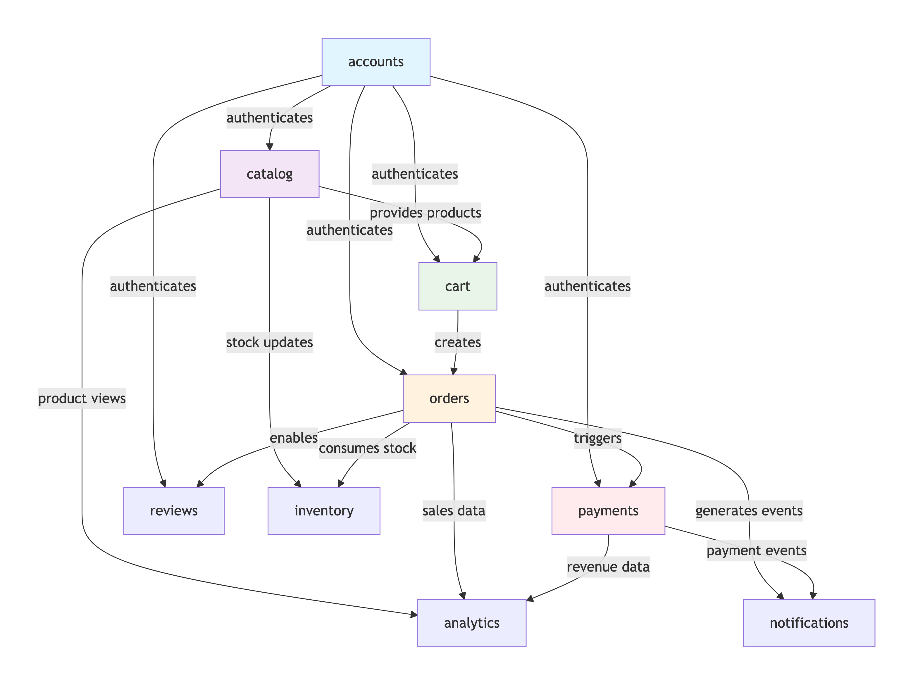

# E-Commerce Platform System Architecture

The image below illustrates the high-level architecture of the E-Commerce Platform.

## Dependency Graph & App Relationships

The diagram below shows the dependencies between the different Django apps in the E-Commerce Platform.
